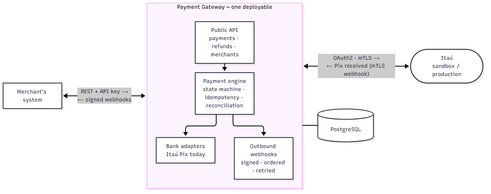

# Architecture

One deployable, four business modules, one library. Deeper detail lives in the code and in
`docs/superpowers/`; this page is the picture you show someone in five minutes.

## The big picture

The gateway never touches money. It talks to the merchant's own bank account (the merchant's Itaú
credentials, stored encrypted per merchant and environment), keeps the state of each payment, and
tells the merchant what happened through signed webhooks.

## Modules and who may import whom

`kernel` imports nothing; nobody imports `app`; `merchants` and `payments` do not import each other;
only `app` imports `providers`. `ArchitectureTest` (ArchUnit) fails the build if a diagram lied.

## Creating a Pix charge

The payment is stored before the bank is called, so a timeout can never lose a charge the bank
accepted: the gateway asks the bank before declaring failure.

## Getting paid

The webhook is a trigger, the bank is the truth: every notification is confirmed with the bank
before the payment completes. Two jobs cover the case where the webhook never arrives: expiration
(asks the bank first) and reconciliation (every 15 min, opens a divergence for a human on mismatch).

## Payment states

Refunds are a projection (`refunded_amount`) on a completed payment, not a state. Every change
appends an event; the current state is reconstructible from the log.

## Environments

| API key | provider endpoint | credential |
|---|---|---|
| `gk_test_…` | Itaú sandbox (plain OAuth2) | `client_id`, `client_secret`, `pix_key` |
| `gk_live_…` | Itaú production (OAuth2 over mTLS) | the above + `x_itau_apikey`, certificate, private key |

Verified against the real sandbox on 2026-09-25: token, create charge, read, cancel. See
`docs/providers/itau/NOTES.md` for what the sandbox does and does not prove.

Diagram sources are the `.mmd` files next to the PNGs. Regenerate one with
`npx -y @mermaid-js/mermaid-cli -i docs/diagrams/<name>.mmd -o docs/diagrams/<name>.png -b white -s 2`.
