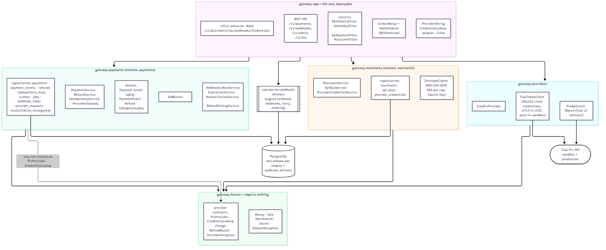
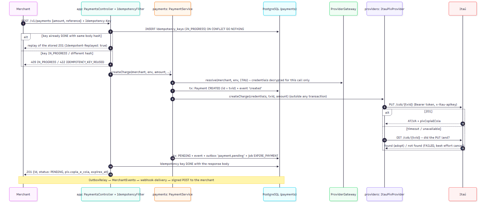
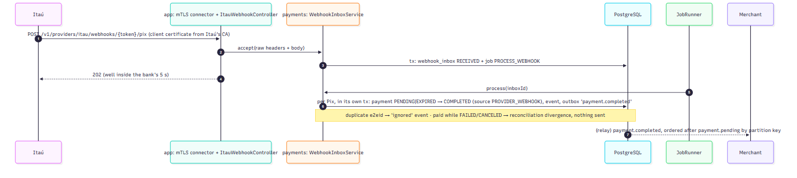
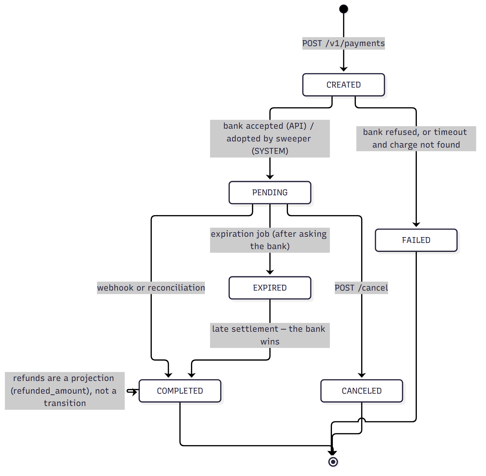

# Architecture

One deployable, four business modules, one library. The boundary between modules is enforced by `ArchitectureTest` (ArchUnit) — a diagram that lied would fail the build.

## Modules and who may import whom

Source: [`diagrams/modules.mmd`](diagrams/modules.mmd) — regenerate with `npx -y @mermaid-js/mermaid-cli -i docs/diagrams/modules.mmd -o docs/diagrams/modules.png -b white -s 2`.

Rules the test enforces: `kernel` imports nothing; nobody imports `app`; `merchants`, `payments` (and later `orders`) do not import each other; only `app` imports `providers`; `payments` sees the bank only through `PixProvider`; Itaú vocabulary (`cob`, `txid`, `devolucao`) never leaves `gateway-providers`.

## Creating a Pix charge

Source: [`diagrams/create-charge.mmd`](diagrams/create-charge.mmd) — regenerate with `npx -y @mermaid-js/mermaid-cli -i docs/diagrams/create-charge.mmd -o docs/diagrams/create-charge.png -b white -s 2`.

## Getting paid

Source: [`diagrams/getting-paid.mmd`](diagrams/getting-paid.mmd) — regenerate with `npx -y @mermaid-js/mermaid-cli -i docs/diagrams/getting-paid.mmd -o docs/diagrams/getting-paid.png -b white -s 2`.

Backstops that do not depend on the webhook:

- **Expiration job** (`expires_at` + 5 min): asks the bank first (`GET /cob/{txid}`); only an unpaid charge becomes `EXPIRED`.
- **Reconciliation job** (every 15 min): lists the bank's charges for the window; `PENDING|EXPIRED × CONCLUIDA` completes the payment; anything else contradictory opens a `reconciliation_divergences` row for a human.
- **Refund polling** (every 5 min, up to 24 h): Itaú's refund is asynchronous; `EM_PROCESSAMENTO` is polled until `DEVOLVIDO`/`NAO_REALIZADO`.

## Payment states

Source: [`diagrams/payment-states.mmd`](diagrams/payment-states.mmd) — regenerate with `npx -y @mermaid-js/mermaid-cli -i docs/diagrams/payment-states.mmd -o docs/diagrams/payment-states.png -b white -s 2`.

Every transition is a row in `PaymentTransitions` with the sources allowed to trigger it; a test walks the whole cross product. Every change appends a `payment_events` row whose `sequence` is the aggregate's version (optimistic lock) — the current state is reconstructible from the log.

## Environments and credentials

| environment (from the API key) | provider endpoint | credential shape |
|---|---|---|
| `TEST` (`gk_test_…`) | Itaú sandbox, token at `/api/oauth/jwt`, no mTLS | `{client_id, client_secret, pix_key}` |
| `LIVE` (`gk_live_…`) | Itaú production, STS token over mTLS, `x-itau-apikey` | `{client_id, client_secret, x_itau_apikey, certificate_pem, private_key_pem, pix_key}` |

Credentials are stored per `(merchant, provider, environment)` in an AES-256-GCM envelope (fresh DEK per row, AAD = `merchant|provider|environment`, master key from `GATEWAY_MASTER_KEY`) and decrypted only for the duration of a bank call.

## Where things live

- Specs and decisions: `docs/superpowers/specs/`, `docs/superpowers/DECISOES.md`
- Bank facts: `docs/providers/itau/NOTES.md` (+ the official OpenAPI next to it)
- Plans executed: `docs/superpowers/plans/`
