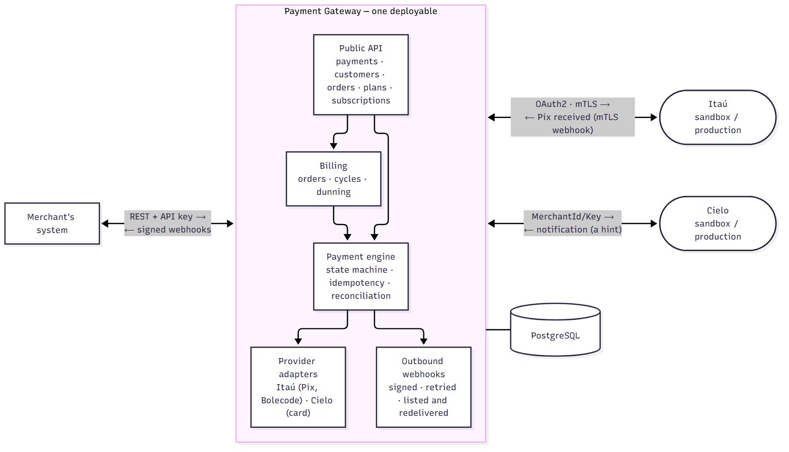
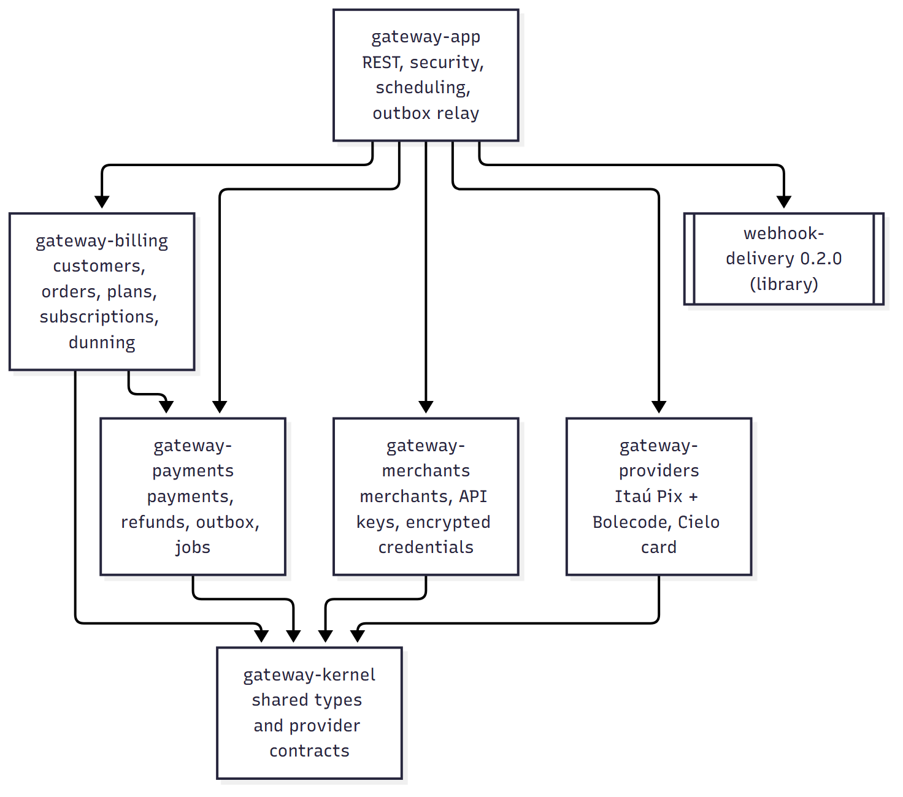
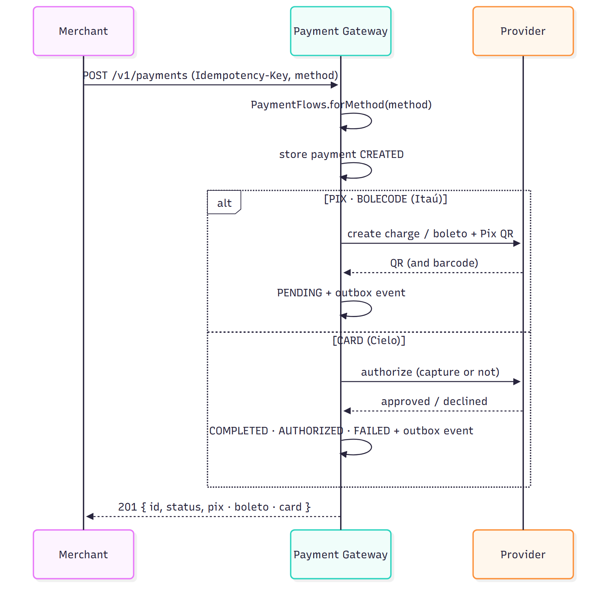
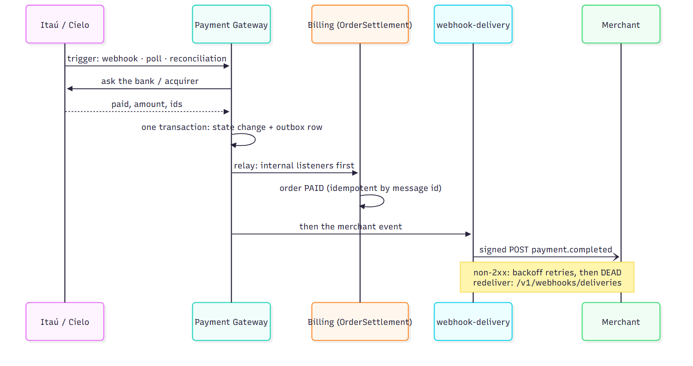
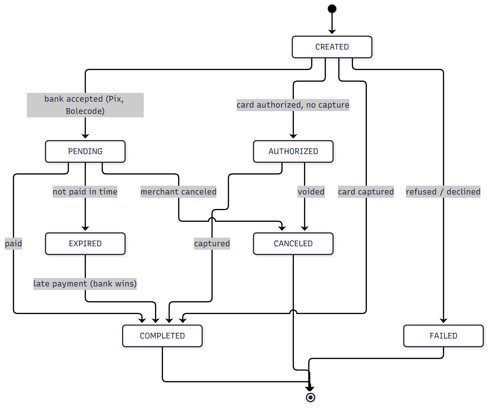
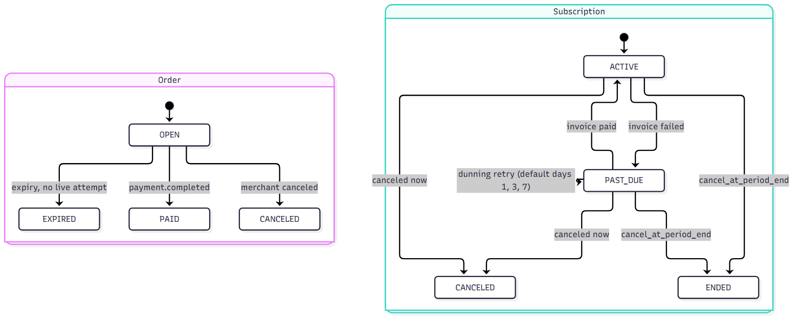

# Architecture

One deployable, five business modules, one kernel, one library. Deeper detail lives in the code and in
`docs/superpowers/`; this page is the picture you show someone in five minutes.

## The big picture

The gateway never touches money. It talks to the merchant's own accounts with the merchant's own
credentials, stored encrypted per merchant, provider and environment, keeps the state of each payment,
and tells the merchant what happened through signed webhooks.

Three methods, two providers: **Pix** and **Bolecode** (a registered boleto plus a Pix QR in one call)
through Itaú, **card** through Cielo. On top of single payments, billing adds customers, orders, plans
and subscriptions that bill themselves every cycle and chase failed invoices (dunning).

## Modules and who may import whom

| module | what it owns |
|---|---|
| `gateway-kernel` | shared value types (money, document, address, ids) and the provider contracts (`MethodProvider`, Pix/boleto/card) |
| `gateway-merchants` | merchants, API keys, provider credentials encrypted per merchant and environment |
| `gateway-providers` | the Itaú (Pix, Bolecode) and Cielo (card) clients, behind the kernel contracts |
| `gateway-payments` | payments, refunds, idempotency, outbox, job runner, reconciliation |
| `gateway-billing` | schema `billing`: customers, orders with one active attempt, plans, subscriptions, cycles, dunning |
| `gateway-app` | the deployable: REST, security, inbound provider webhooks, scheduling, outbox relay, provider wiring |
| `webhook-delivery` | library (`com.barrier`, 0.2.0): signed outbound webhooks, retries, listing and redelivery |

Arrows are the Maven dependencies. The rules `ArchitectureTest` (ArchUnit) enforces:

- `kernel` imports nothing (no other module, no Spring, no JPA).
- Nobody imports `app`.
- `merchants` imports none of the other business modules.
- `payments` never imports `providers` nor `billing`: it calls banks only through the kernel contracts,
  and the app wires the implementations.
- `billing` may import only `kernel`, `payments` and `merchants` (today it uses the first two).
- `providers` imports only `kernel`; Itaú and Cielo class names never leave it.
- JPA lives only under `..persistence..` packages, and JPA entities are package-private.

## Creating a charge

`POST /v1/payments` carries a `method`, and `PaymentFlows.forMethod(method)` picks the one flow for it
(Pix, Bolecode, card); a method with no flow, or with two, fails the startup. Each flow asks
`ProviderGateway` for its typed provider and the merchant's credential. Billing creates its payment
attempts through the same flows.

The payment is stored before the provider is called, so a timeout can never lose a charge the bank
accepted: the gateway asks the provider before declaring failure, and a sweep adopts a charge stuck in
`CREATED` once the provider confirms it exists.

## Getting paid

A webhook, a poll or reconciliation is a trigger; the bank (or the acquirer) is the truth. Every
trigger is confirmed with the provider before the payment moves, and the state change and its outbox
row are written in one transaction.

`OutboxRelay` (in the app) then calls the in-process `OutboxListener`s first — billing's
`OrderSettlement` marks the order paid, idempotent by message id — and only then hands the event to
`webhook-delivery`, so a merchant never learns "order paid" before the order row says so. A listener
that throws keeps the row for the next pass. Delivery is at least once and ordered per partition key;
a delivery that keeps failing goes `DEAD` and stays so until the merchant redelivers it through
`/v1/webhooks/deliveries`.

## State machines

The transitions, and who may trigger each one, are a table in `PaymentTransitions`. A late payment of
an `EXPIRED` charge completes it: the bank wins. A card never passes through `PENDING` or `EXPIRED`:
it is captured at once or stops at `AUTHORIZED` until captured or voided, and the gateway never voids
an authorization on its own. Refunds are a projection (`refunded_amount`) on a completed payment, not a
state. Every change appends an event; the current state is reconstructible from the log.

An order is what the payer owes and has at most one active payment attempt; `OPEN` is its only state
that moves. A subscription opens one order per cycle (the invoice). A failed invoice makes it
`PAST_DUE` and dunning retries on `gateway.billing.dunning-retry-days`; a paid invoice brings it back
to `ACTIVE`. Dunning never cancels: exhaustion is announced (`subscription.dunning_exhausted`) and what
to do next is the merchant's decision. `CANCELED` is immediate, `ENDED` is the end of a
`cancel_at_period_end`.

## Background jobs

One job runner in `payments` (Postgres, `SKIP LOCKED`); each `JobType` has its handler. A failed job is
retried with backoff and goes `DEAD` after its last attempt — except the billing jobs, which never go
`DEAD`: a dead row would stop billing or chasing an invoice silently, so they keep retrying at
`order-expiry-recheck` and log an error for an operator.

| `JobType` | what it does |
|---|---|
| `PROCESS_WEBHOOK` | confirms one stored provider webhook with the provider and applies it |
| `EXPIRE_PAYMENT` | expires one `PENDING` payment at its limit, asking the bank first |
| `POLL_REFUND` | asks the bank whether a processing refund settled; gives up into a divergence |
| `RECONCILE` | every 15 min: the stuck-`CREATED` sweep, then reconciliation against the bank and the acquirer |
| `POLL_BOLETO` | asks Itaú whether a Bolecode's barcode was paid, every 6 h until the limit date |
| `EXPIRE_ORDER` | billing: expires an order; waits, without spending retries, while an attempt is live |
| `BILL_SUBSCRIPTION` | billing: one cycle of a subscription (one row per subscription for its life) |
| `DUNNING_RETRY` | billing: one scheduled retry of a failed invoice |

## Operations and disputes

The operator works through `/v1/admin`: the divergence queue (reconciliation findings and merchant disputes in
one table, told apart by `origin`), the job queue (`run-now` on a `PENDING` or `DEAD` job, `give-up` on a
`PENDING` one) and the stuck payments. A dispute is a divergence with `origin = MERCHANT`; resolving any
divergence never moves money — a refund is always its own act through `/refunds`. Prometheus gauges are
recounted every 30 s and served, with `/actuator/health`, on the management port (`GATEWAY_MANAGEMENT_PORT`,
default 9090), which has no authentication of its own and must stay off the public network.

## The payer's door

An order carries a link, `/v1/checkout/{token}`, that lets the payer see it and pay without an API key: the
token is the authorization, stored only as a hash and shown once (rotation replaces it). It is the one public
surface, so it is rate-limited per IP and masks the token in logs. Billing owns orders but must not import
`merchants`, where the peppered hashing of API keys lives; it declares a `TokenHasher` port and the app wires
`PepperedTokenHasher` into it, so the token is hashed the same way as a key without a new module dependency.

## Environments

| API key | provider | credential |
|---|---|---|
| `gk_test_…` | Itaú sandbox (plain OAuth2) | `client_id`, `client_secret`, `pix_key` |
| `gk_live_…` | Itaú production (OAuth2 over mTLS) | the above + `x_itau_apikey`, certificate, private key |
| `gk_test_…` / `gk_live_…` | Cielo sandbox / production | `merchant_id`, `merchant_key` |

What each sandbox does and does not prove is in `docs/providers/itau/NOTES.md`,
`docs/providers/cielo/NOTES.md` and the end-to-end reports in `docs/e2e/`.

## Where to read more

- `docs/superpowers/README.md` — the index of specs and plans, by date.
- `docs/superpowers/specs/` — the designs; `docs/superpowers/plans/` — how each was built.
- `docs/superpowers/DECISOES.md` — append-only decisions, each with the rejected alternative and the
  cost of being wrong.
- `docs/providers/*/NOTES.md` — facts about each provider; `docs/e2e/` — sandbox happy-path reports.

Diagram sources are the `.mmd` files next to the PNGs. Regenerate one with
`npx -y @mermaid-js/mermaid-cli -i docs/diagrams/<name>.mmd -o docs/diagrams/<name>.png -b white -s 2`.
